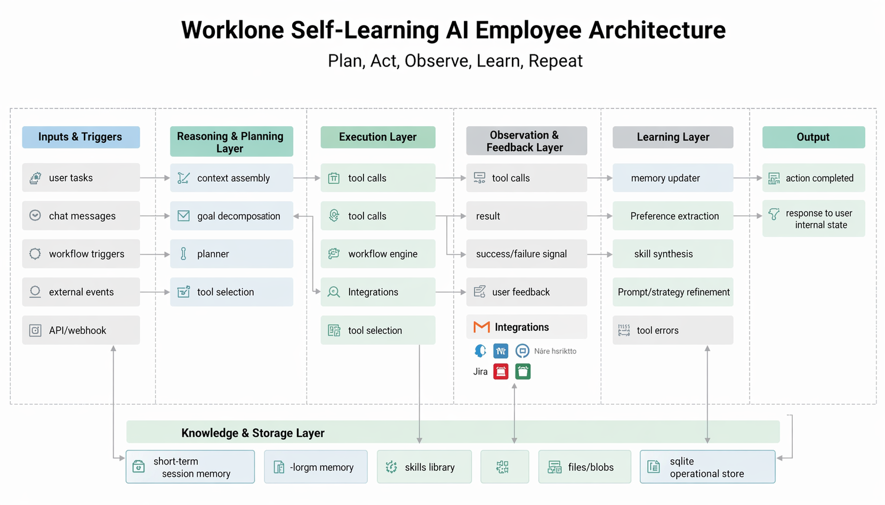

# Worklone: AI Employees That Learn & Adapt

[](LICENSE)
[](docker-compose.yml)
[](docs/CONTRIBUTING.md)
[](https://fastapi.tiangolo.com/)
[](https://react.dev/)


**Worklone** is a cloud-managed AI employee platform for organizations. It lets you create, manage, and deploy AI employees for your business. These are not static chatbots: they are autonomous agents that reason, use tools, execute workflows, collaborate with each other, and **get smarter over time** through self-learning.

Think of Worklone as your digital workforce: hire AI employees for product management, engineering, sales, support, operations, or any role you define. Each employee learns your preferences, builds skills from experience, and improves with every interaction.



## Usage Notice

This repository is released for **non-commercial research and evaluation only**.
Commercial use, resale, hosted paid offerings, or product monetization are not allowed without prior written permission. See [LICENSE](LICENSE).

---

## Why Worklone?

| Traditional Automation | Worklone AI Employees |
|------------------------|----------------------|
| Rigid if-then rules | Autonomous reasoning with ReAct |
| Manual updates required | Self-learning from experience |
| Single-purpose bots | Multi-tool, multi-skill agents |
| No memory or context | Remembers users, builds skills |
| Closed-source, expensive | Research-use source available, self-hosted |

---

## Features

### Self-Adapting AI Employees
- **Learns from every interaction** — automatically captures user preferences, work styles, and domain knowledge
- **Builds skills autonomously** — discovers multi-step procedures through trial-and-error and saves them as reusable skills
- **Improves over time** — the more you use it, the better it gets at understanding your needs

### AI Employee System
- **Create custom employees** with specific roles, personalities, and capabilities
- **Self-learning employees** — adaptive employees that improve through production feedback loops
- **Assign 500+ tools** — from GitHub and Slack to Salesforce and Stripe
- **Track performance** — monitor tokens, costs, and activity per employee
- **Team collaboration** — employees can message each other and work together on tasks

### Massive Tool Ecosystem
- **500+ pre-built tools** across GitHub, Slack, Gmail, Jira, Notion, Salesforce, Stripe, Linear, HubSpot, Google Drive, Google Calendar, and more
- **Custom tool framework** — add your own tools in under 50 lines of code
- **Native function calling** — agents autonomously decide which tools to use and when

### DAG-Based Workflow Engine
- **Visual workflow builder** — 13 block types including agents, tools, conditions, loops, and parallel execution
- **Multiple triggers** — API, webhook, schedule (cron), or manual
- **Human-in-the-loop** — approval blocks for critical decisions
- **Background execution** — long-running workflows with monitoring and history

### Private & Self-Hosted
- **100% self-hosted** — your data never leaves your infrastructure
- **Persistent data layer** — SQLite for application state, Redis for dispatch/realtime coordination
- **Multi-tenant** — owner-based data isolation with session and API key auth

---

## Quick Start

### Prerequisites
- Docker Desktop (or Docker Engine + Compose)
- An [OpenRouter API key](https://openrouter.ai/) (or NVIDIA API key)

### 1. Clone & Configure
```bash
git clone https://github.com/hritvikgupta/worklone.git
cd worklone
cp .env.example .env
```

Edit `.env` and set:
- `OPENROUTER_API_KEY=...`
- `DEPLOYMENT_MODE=self_hosted` (for open-source/self-hosted usage)

### 2. Start the Platform
```bash
./scripts/docker-up.sh
```

The script:
- starts Docker if needed
- frees frontend port conflicts
- builds images
- starts `frontend + backend + redis`

Stop services:
```bash
docker compose down
```

### 3. Open Worklone
Open:
- Frontend: `http://localhost:3000`
- Backend API: `http://localhost:8000`
- Backend docs: `http://localhost:8000/docs`

---

## Documentation

| Document | Description |
|----------|-------------|
| [Architecture](docs/ARCHITECTURE.md) | System design, data flow, and principles |
| [AI Employees](docs/AGENTS.md) | How employees work, create, and collaborate |
| [Self-Learning](docs/SELF_LEARNING.md) | How employees learn and improve over time |
| [Tool System](docs/TOOLS.md) | Available tools and how to build custom ones |
| [Workflows](docs/WORKFLOWS.md) | DAG workflow engine, block types, and triggers |
| [API Reference](docs/API_REFERENCE.md) | REST endpoints, WebSocket, and authentication |
| [Contributing](docs/CONTRIBUTING.md) | How to contribute, style guide, and testing |
| [Security](SECURITY.md) | Security policy and reporting |

---

## Use Cases

### Product Management
Self-learning product employees can:
- Write PRDs and user stories
- Prioritize features using RICE or MoSCoW
- Plan sprints and roadmaps
- Analyze user feedback and metrics

### Engineering
AI engineers can:
- Create and manage GitHub issues and PRs
- Review code and suggest improvements
- Run tests and debug failures
- Document codebases and APIs

### Sales & CRM
AI sales reps can:
- Manage Salesforce leads and opportunities
- Draft personalized outreach emails
- Track deal pipelines and forecast revenue
- Schedule meetings via Google Calendar

### Customer Support
AI support agents can:
- Respond to tickets via Slack or email
- Search knowledge bases (Notion, Google Drive)
- Escalate complex issues to human agents
- Track satisfaction and resolution metrics

### Operations
AI ops managers can:
- Monitor Stripe subscriptions and payments
- Generate reports from multiple data sources
- Automate recurring tasks with scheduled workflows
- Coordinate across teams and tools

---

## Tech Stack

**Backend:** FastAPI, Python 3.11 (Docker image), SQLite, Redis, httpx, Pydantic, Uvicorn
**Frontend:** React 19, TypeScript, Vite, Tailwind CSS v4, shadcn/ui, Recharts
**LLM Providers:** OpenRouter, OpenAI, Groq, NVIDIA NIM (user-configurable)
**Integrations:** GitHub, Slack, Gmail, Jira, Notion, Salesforce, Stripe, Linear, HubSpot, Google Drive, Google Calendar, and more

---

## Roadmap

- [ ] Autonomous Skill Acquisition (learning new tools via documentation)
- [ ] Multi-Agent Collaboration Framework
- [ ] One-Click Docker Deployment
- [ ] Enterprise SSO & RBAC
- [ ] Vector memory for long-term knowledge retention
- [ ] Employee performance analytics dashboard
- [ ] Marketplace for pre-built employee templates

---

## Contributing

We welcome contributions! Whether it's fixing a bug, adding a tool, or improving documentation—every contribution matters. See our [Contributing Guide](docs/CONTRIBUTING.md) to get started.

---

## License

This project is licensed under the [Worklone Non-Commercial Research License v1.0](LICENSE).

---

<p align="center">Built with ❤️ by the Worklone Community</p>
